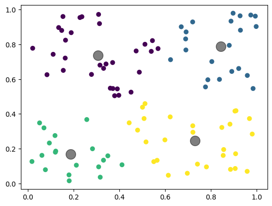
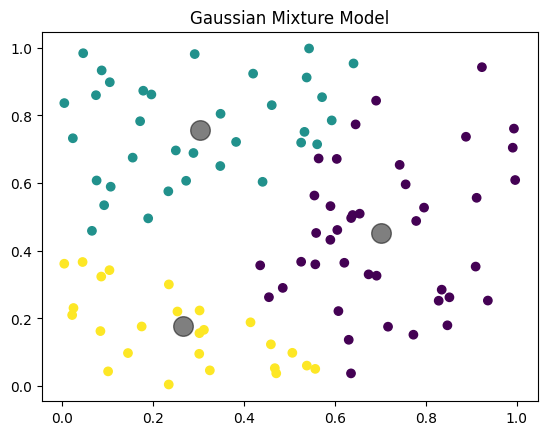
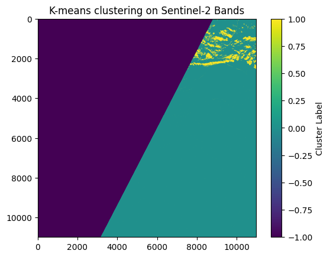
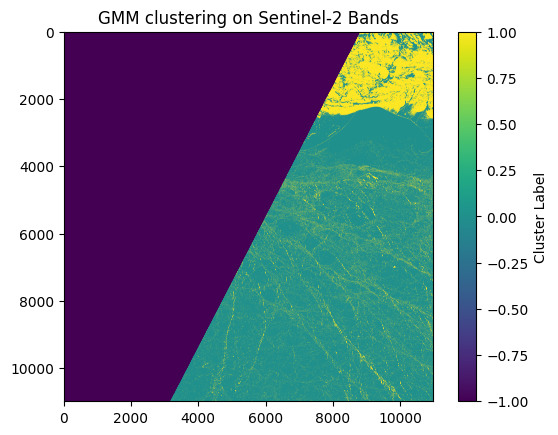
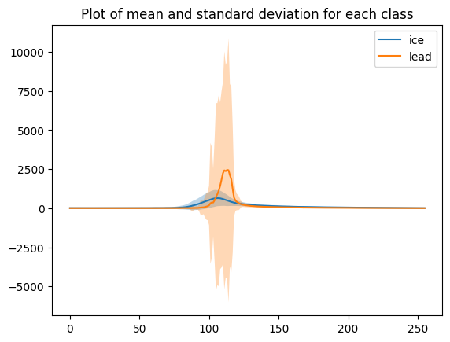
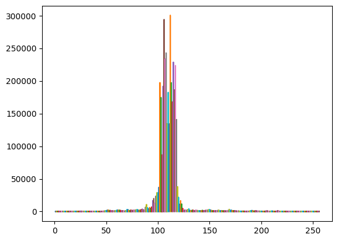
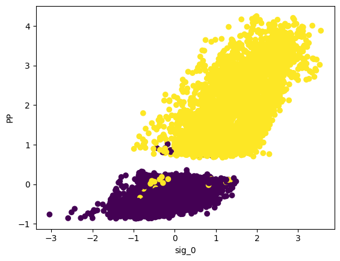
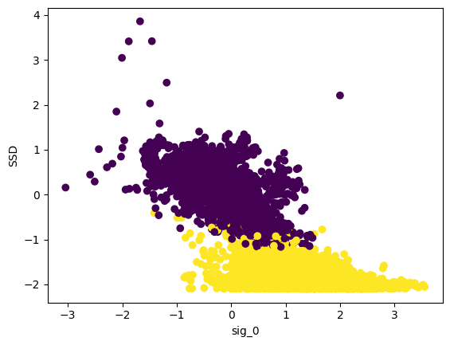
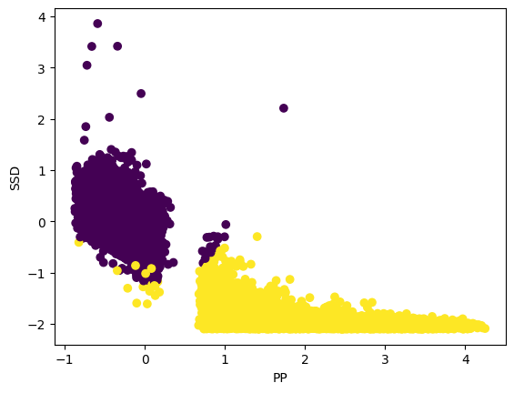
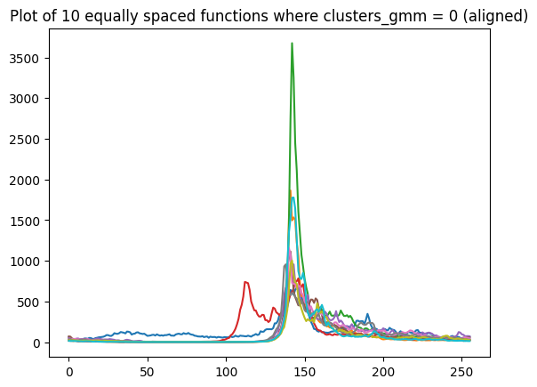

# Introduction to Unsupervised Learning for Earth Observation

Unsupervised learning is a branch of machine learning that focuses on discovering hidden patterns and structures in data without relying on predefined labels. In the context of Earth Observation (EO), unsupervised methods are invaluable for classifying and interpreting complex datasets, such as optical images and altimetry measurements, where manual labeling is often impractical.

## Overview

This guide introduces two primary EO classification tasks using unsupervised learning techniques:

1. **Image Classification with Sentinel-2 Optical Data**  
   Discriminating between sea ice and leads by processing and clustering spectral bands from Sentinel-2 imagery.

2. **Altimetry Classification with Sentinel-3 Data**  
   Identifying sea ice and leads by analyzing altimetry measurements, which involves advanced pre-processing and feature extraction.

The practical implementations presented here focus on clustering methods—specifically K-means and Gaussian Mixture Models (GMM)—to automatically discern natural groupings in the data.

## Unsupervised Learning Techniques

### K-means Clustering
K-means clustering partitions a dataset into *k* distinct clusters by:
- **Initialization:** Defining *k* centroids.
- **Assignment:** Allocating each data point to the nearest centroid based on a distance metric (typically the squared Euclidean distance).
- **Update:** Recalculating centroids as the mean of the data points assigned to each cluster.

**Key Advantages:**
- **Simplicity and Scalability:** Easy to implement and computationally efficient.
- **Exploratory Analysis:** Useful when the structure of the data is not known a priori.

A basic Python implementation demonstrates how to generate clusters from random sample data and visualize the centroids.

### Gaussian Mixture Models (GMM)
Gaussian Mixture Models offer a probabilistic approach by assuming that the data is generated from a mixture of several Gaussian distributions. Unlike K-means, GMM provides soft clustering, meaning that each data point is assigned a probability of belonging to each cluster.

**Key Features:**
- **Expectation-Maximization (EM) Algorithm:** Iteratively refines the parameters (mean, covariance, and mixing coefficients) of each Gaussian component.
- **Flexibility:** Clusters can have different shapes and sizes, thanks to various covariance structures.
- **Soft Clustering:** Offers insights into the uncertainty and variability of the cluster assignments.

A sample implementation in Python illustrates how to fit a GMM to data and visualize the resulting clusters and their centers.

## Application to Earth Observation Data

### Image Classification with Sentinel-2

For optical image classification, the workflow includes:
- **Data Preparation:** Reading and stacking spectral bands (e.g., B2, B3, B4) using libraries like `rasterio`.
- **Masking and Reshaping:** Creating masks to filter out invalid data and reshaping the data for clustering.
- **Clustering:** Applying K-means or GMM to classify the pixels into distinct clusters (sea ice vs. leads).
- **Visualization:** Displaying the classified images and scatter plots to interpret cluster distributions.

### Altimetry Classification with Sentinel-3

Altimetry data requires more extensive pre-processing:
- **Data Ingestion:** Loading NetCDF files and extracting variables such as latitude, longitude, waveform, and signal intensity.
- **Feature Extraction:** Computing additional features like *peakiness* and *stack standard deviation (SSD)* to better characterize the data.
- **Data Cleaning:** Removing NaN values and filtering based on quality flags.
- **Clustering with GMM:** Applying a Gaussian Mixture Model to segment the data into classes representing sea ice and leads.
- **Post-processing and Evaluation:**  
  - **Visualization:** Plotting mean waveforms, scatter plots, and aligned echoes using cross-correlation.
  - **Comparison:** Evaluating the clustering results against official datasets (e.g., adjusting ESA product labels) using confusion matrices.

Supporting functions (e.g., `peakiness`, `unpack_gpod`, and `calculate_SSD`) streamline the process of feature computation and data transformation, ensuring that the clustering algorithms work effectively on the EO datasets.

## Conclusion

This guide provides a comprehensive, practical introduction to using unsupervised learning methods in EO applications. By leveraging clustering techniques like K-means and GMM, analysts can:

- Automatically detect and classify patterns in complex geospatial data.
- Effectively distinguish between different natural phenomena (e.g., sea ice and leads) without the need for extensive labeled datasets.
- Gain deeper insights through advanced feature extraction and visualization techniques.

The step-by-step code examples serve as a starting point for developing robust EO data analysis pipelines, enabling researchers to tackle real-world classification challenges with confidence.
